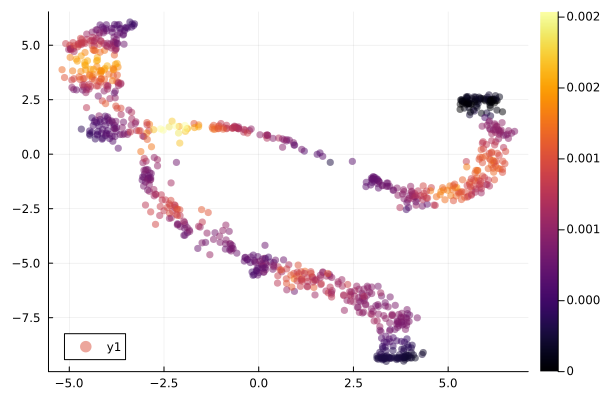
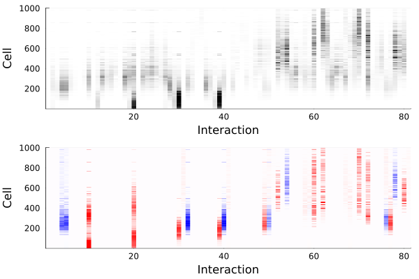
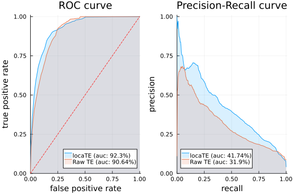
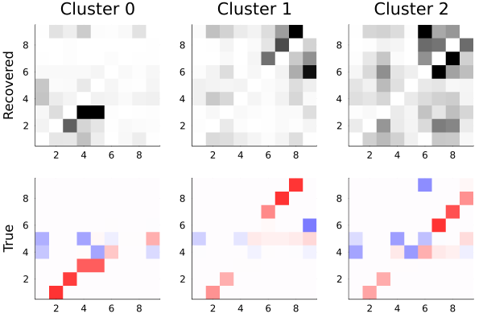
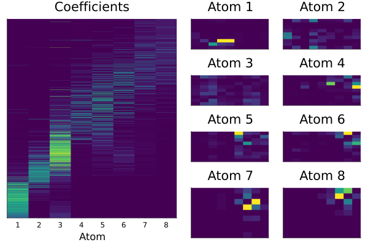
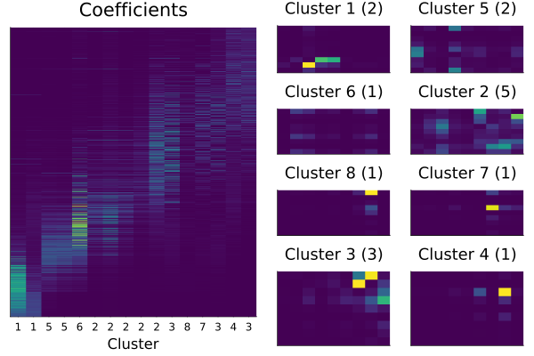

```@meta
EditURL = "<unknown>/examples/data_bifurcating/script.jl"
```

# Bifurcating example

[](<unknown>/examples/data_bifurcating.ipynb)

*You are seeing the
HTML output generated by [Documenter.jl](https://github.com/JuliaDocs/Documenter.jl) and
[Literate.jl](https://github.com/fredrikekre/Literate.jl) from the
[Julia source file](<unknown>/examples/data_bifurcating/script.jl).
The corresponding notebook can be viewed in [nbviewer](<unknown>/examples/data_bifurcating.ipynb).*

## Loading required packages
Load scNetworkInference.jl and other required packages
using Pkg
Pkg.develop(path="/home/syz/scNetworkInference.jl/")

````julia
using NPZ
using NNlib
using OptimalTransport
using StatsBase
using SparseArrays
using LinearAlgebra
using Plots
using LaTeXStrings
using Graphs
using GraphSignals
using NearestNeighbors
using ProgressMeter
using Discretizers
import scNetworkInference as scN;
using Suppressor
````

## Load expression values from BoolODE simulation output.
We set small expression values to zero -- these are artifacts of simulation, since they are generated
using a chemical Langevin equation approximation. Alternatively, one could just use constant-width bins
for the discretizer or simulate data from a more involved Gillespie scheme.

````julia
cd("../../../examples/data_bifurcating")
X = relu.(npzread("X.npy") .- 10^(-0.5));
X_pca = npzread("X_pca.npy")
X_tsne = npzread("X_tsne.npy")
P = npzread("P_velo_dot.npy")
dpt = npzread("dpt.npy")
C = npzread("C.npy")
J = permutedims(npzread("J.npy"), [1, 3, 2]);
id = npzread("clusterid.npy");
````

construct neighbourhoods using QOT

````julia
R = quadreg(ones(size(X, 1)), ones(size(X, 1)), C, 2.5*mean(C));
````

list of gene pairs

````julia
gene_idxs = vcat([[j, i]' for i = 1:size(X, 2) for j = 1:size(X, 2)]...);
````

## Construct sparse forward and backward transition matrices for `k` steps of `P`.

````julia
k = 3
π_unif = fill(1/size(P, 1), size(P, 1))'
Q = (P' .* π_unif)./(π_unif * P)';
R_sp = sparse(R)
QT_sp = sparse((Q^k)')
P_sp = sparse((P^k));
````

plot forward/backward for a selected cell

````julia
p0 = R[sortperm(dpt)[250], :]
plot(scatter(X_tsne[:, 1], X_tsne[:, 2]; marker_z = p0, markerstrokewidth = 0, alpha = 0.25, title = L"π_0"),
     scatter(X_tsne[:, 1], X_tsne[:, 2]; marker_z = P_sp'*p0 - p0, color = :bwr, clim = (-0.0025, 0.0025), markerstrokewidth = 0.25, alpha = 0.25, title = L"π_{1} - π_{-1}"); legend = nothing)
````


## Construct kNN and Laplacian

````julia
kdtree = KDTree(X_pca')
idxs, dists = knn(kdtree, X_pca', 25);
A = spzeros(size(X_pca, 1), size(X_pca, 1));
for (i, j) in enumerate(idxs)
    A[i, j] .= 1.0
end
L = sparse(normalized_laplacian(max.(A, A'), Float64));
````

## Perform directed inference

````julia
@info "Directed inference"
mi_all = zeros(size(X, 1), size(X, 2)^2);
@info "Computing RDI scores"
alg = DiscretizeBayesianBlocks()
disc = scN.discretizations_bulk(X; alg = alg)
for i = 1:size(X, 1)
    mi_all[i, :] = scN.get_MI(X, scN.compute_coupling(X, i, P_sp, QT_sp, R_sp), gene_idxs[:, 1], gene_idxs[:, 2]; disc = disc, alg = alg)
end
@info "Applying CLR"
mi_all_clr = scN.apply_wclr(mi_all, size(X, 2))
mi_all_clr[isnan.(mi_all_clr)] .= 0;
````

````
[ Info: Directed inference
[ Info: Computing RDI scores
[ Info: Applying CLR

````

## Denoise using graph-regularized regression

````julia
@info "Denoising"
w = normalize(vec(sqrt.(sum(mi_all_clr.^2; dims = 2))), 1) # weights (optional)
G = @suppress scN.fitsp(mi_all_clr, L; λ1 = 25.0, λ2 = 0.001, maxiter = 500);
G_symm = scN.symm_row(G, size(X, 2)); # symmetrized version for comparison to undirected methods
````

````
[ Info: Denoising
[ Info: ΔX = 4.190988784068904e-8, ΔZ = 9.309533380789936e-6, ΔW = 1.7731256087838432e-5
[ Info: tr(X'LX) = 0.18907466432954684, 0.5|X-G|^2 = 1.4624852429206463, |X|1 = 397.9211653010525

````

we can plot the TE density

````julia
scatter(X_tsne[:, 1], X_tsne[:, 2]; marker_z = w, markerstrokewidth = 0, clim = (0, quantile(w, 0.995)), alpha = 0.5)
````


Interaction by cell

````julia
plt=plot(heatmap(G[sortperm(dpt), :]; xlabel = "Interaction", ylabel = "Cell", c = cgrad([:white, :black]), clim = (0, quantile(vec(G), 0.995))),
    heatmap((R * reshape(J, :, size(X, 2)^2))[sortperm(dpt), :], c = :bwr, clim = (-1.5, 1.5); xlabel = "Interaction", ylabel = "Cell"),
    colorbar = nothing, layout = (2, 1))
plt
````


## ROC and PR curves

````julia
using EvalMetrics
plt1=rocplot(vec(R * reshape(abs.(J), :, size(X, 2)*size(X, 2))) .> 0.5, vec(G); label = "locaTE");
rocplot!(vec(R * reshape(abs.(J), :, size(X, 2)*size(X, 2))) .> 0.5, vec(mi_all); label = "Raw TE");
plt2=prplot(vec(R * reshape(abs.(J), :, size(X, 2)*size(X, 2))) .> 0.5, vec(G); label = "locaTE");
prplot!(vec(R * reshape(abs.(J), :, size(X, 2)*size(X, 2))) .> 0.5, vec(mi_all); label = "Raw TE");
plot(plt1, plt2)
````


## Plot averaged interactions by cluster

````julia
plt1=plot([heatmap(normalize(reshape(mean(G[id .== i, :]; dims = 1), size(X, 2), size(X, 2)), Inf), c = cgrad([:white,  :black]), title = "Cluster $i", clim = (0, 0.75), ylabel = i == 0 ? "Recovered" : "") for i in sort(unique(id))]...; layout = (1, 3), colorbar = nothing)
plt2=plot([heatmap(normalize(mean(J[id .== i, :, :]; dims = 1)[1, :, :], Inf); c = :bwr, clim = (-1.25, 1.25), ylabel = i == 0 ? "True" : "") for i in sort(unique(id))]...; layout = (1, 3), colorbar = nothing)
plt=plot(plt1, plt2; layout = (2, 1))
plt
````


## Factor analysis with NMF

````julia
qnorm(x, q) = x ./ quantile(vec(x), q)
Cg = cor(X).^2; Cg[diagind(Cg)] .= 0
U, V, trace =  @suppress scN.fitnmf(relu.(qnorm(mi_all_clr, 0.9)),
                         [I(size(G, 1)), I(size(G, 2))], 1e-3*I + L,
                         repeat(vec(Cg), 1, size(X, 1))',
                         8;
                         α = 25.0,
                         β = 0.0,
                  λ = [10.0, 10.0],
                  μ = [10.0, 10.0],
                  iter = 2_500, initialize = :nmf, print_iter = 500, dictionary = false, η = 1.0);
G_nmf = U*V';
U .*= mean(V; dims = 1)
V ./= mean(V; dims = 1);
````

````
[ Info: Initializing NMF decomposition with nmf

````

Plot coefficients and atoms

````julia
perm = sortperm(vec(sum((U ./ sum(U; dims = 1)) .* dpt; dims = 1))) # sort atoms by order of activation
plt1=heatmap(U[sortperm(dpt), perm], colorbar = nothing, yaxis = nothing, title = "Coefficients", xticks = (1:size(U, 2)), xlabel = "Atom", c = :viridis);
plt2=plot([heatmap(reshape(v, size(X, 2), size(X, 2)); title = "Atom $i", axis = nothing, clim = (0, quantile(vec(V), 0.99)), c = :viridis) for (i, v) in enumerate(eachcol(V[:, perm]))]...;
          colorbar = nothing, layout = (4, 2));
plot(plt1, plt2)
````


## Factor analysis with NTF

````julia
using TensorToolbox
Cg = cor(X).^2; Cg[diagind(Cg)] .= 0
S, A, trace = @suppress scN.fitntf(Array(reshape(qnorm(mi_all_clr, 0.9), :, size(X, 2), size(X, 2))),
                     [I(size(X, 1)), I(size(X, 2)), I(size(X, 2))], 1e-3*I + L, repeat(reshape(Cg, 1, size(X, 2), size(X, 2)), size(X, 1)),
                     [1, 1, 1],
                     [1, 1, 1],
                     25.0,
                     0.0,
                     16; iter = 500, dictionary = false, η = 1.0);
G_ntf = reshape(ttm(S, A, 1:length(A)), :, size(X, 2)^2);
ntf_atoms = [x*y' for (x, y) in zip(eachcol(A[2]), eachcol(A[3]))];
A[1] .*= mean.(ntf_atoms)'
A[2] ./= sqrt.(mean.(ntf_atoms))'
A[3] ./= sqrt.(mean.(ntf_atoms))'
ntf_atoms ./= mean.(ntf_atoms);
````

cluster atoms

````julia
using Clustering
hc = hclust(1 .- cor(A[1]))
clusts = cutree(hc; k = 8)
ntf_atoms_clust_activity = hcat([sum(A[1][:, clusts .== i]; dims = 2) for i = 1:length(unique(clusts))]...)
ntf_atoms_clust = [sum(ntf_atoms[clusts .== i]) for i = 1:length(unique(clusts))];
ntf_atoms_clust_nums = [sum(clusts .== i) for i = 1:length(unique(clusts))];
perm_clust = sortperm(vec(sum((ntf_atoms_clust_activity ./ sum(ntf_atoms_clust_activity; dims = 1)) .* dpt; dims = 1)))
perm = sortperm(vec(sum((A[1] ./ sum(A[1]; dims = 1)) .* dpt; dims = 1)));
````

Plot coefficients and atoms

````julia
plt2=plot([heatmap(x;
            title = "Cluster $(perm_clust[i]) ($(ntf_atoms_clust_nums[perm_clust[i]]))", axis = nothing, titlefontsize = 12, clim = (0, quantile(vec(hcat(ntf_atoms...)), 0.999)), c = :viridis)
        for (i, x) in enumerate(ntf_atoms_clust[perm_clust])]...; colorbar = nothing, layout = (4, 2));
plt1=heatmap(A[1][sortperm(dpt), perm], colorbar = nothing, yaxis = nothing, title = "Coefficients", xticks = (1:size(A[1], 2), clusts[perm]), xlabel = "Cluster", c = :viridis);
plot(plt1, plt2)
````


---

*This page was generated using [Literate.jl](https://github.com/fredrikekre/Literate.jl).*

