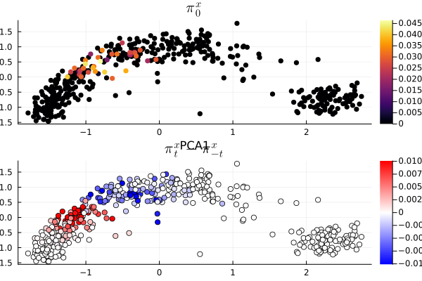
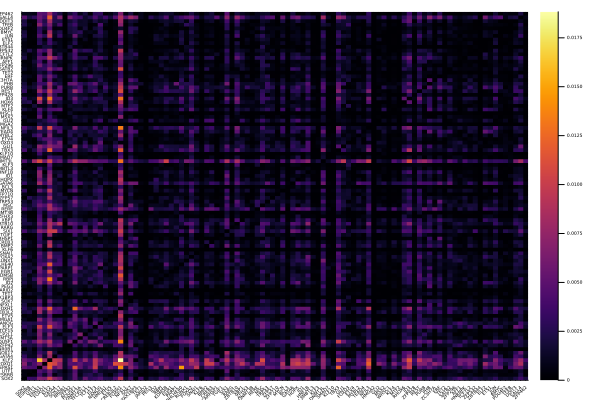
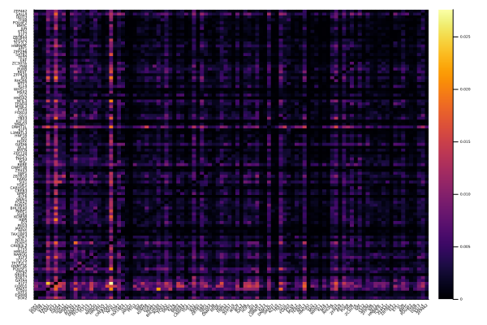
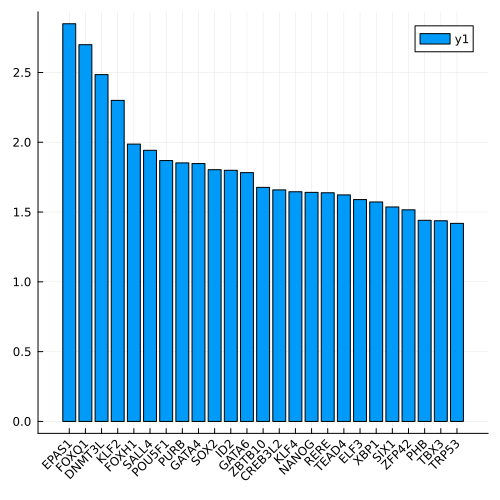
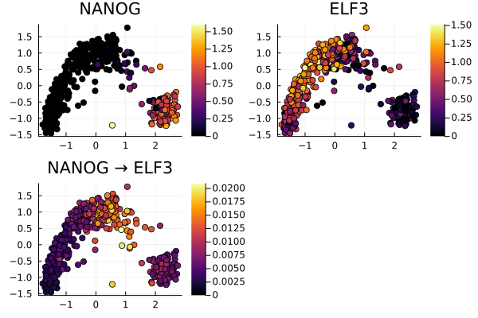
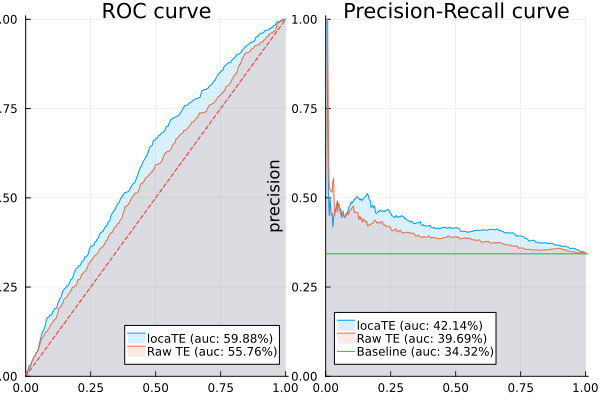
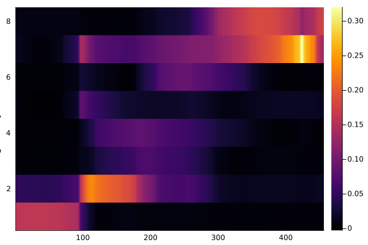

```@meta
EditURL = "<unknown>/examples/data_mesc/script.jl"
```

# Mouse ESC-Endoderm example

[](<unknown>/examples/data_mesc.ipynb)

*You are seeing the
HTML output generated by [Documenter.jl](https://github.com/JuliaDocs/Documenter.jl) and
[Literate.jl](https://github.com/fredrikekre/Literate.jl) from the
[Julia source file](<unknown>/examples/data_mesc/script.jl).
The corresponding notebook can be viewed in [nbviewer](<unknown>/examples/data_mesc.ipynb).*

The dataset for this example can be found from the [SCODE Github repo](https://github.com/hmatsu1226/SCODE).

## Load packages

````julia
using NPZ
using NNlib
using OptimalTransport
using StatsBase
using SparseArrays
using LinearAlgebra
using Plots
using LaTeXStrings
using Graphs
using GraphSignals
using NearestNeighbors
using ProgressMeter
using Discretizers
import locaTE as lTE;
using Suppressor
using CSV, DataFrames
using Printf
````

## Load files
Load dataset and reference

````julia
cd("../../../examples/data_mesc")
X = relu.(npzread("X.npy") .- 1e-2)
X_pca = npzread("X_pca.npy")
P = npzread("P_statot.npy")
C = npzread("C.npy")
dpt = npzread("dpt.npy");
J = npzread("J.npy");
J[diagind(J)] .= 0;
J_escape = npzread("J_ESCAPE.npy");
J_escape[diagind(J_escape)] .= 0;
try
    global genes = Array(CSV.read("genes.txt", DataFrame)[:, 2])
catch e
    @info "Exception: $e"
    global genes = ["gene_$i" for i = 1:size(X, 2)]
end;
````

## Construct neighborhood kernel and couplings

````julia
R = quadreg(ones(size(X, 1)), ones(size(X, 1)), C, 2.5 * mean(C));
gene_idxs = vcat([[j, i]' for i = 1:size(X, 2) for j = 1:size(X, 2)]...);
k = 1
π_unif = fill(1 / size(P, 1), size(P, 1))'
Q = (P' .* π_unif) ./ (π_unif * P)';
P_sp = sparse((P^k))
QT_sp = sparse((Q^k)')
R_sp = sparse(R);
````

## Visualise coupling

````julia
p0 = R[sortperm(dpt)[250], :]
plt = plot(
    scatter(
        X_pca[sortperm(p0), 1],
        X_pca[sortperm(p0), 2];
        marker_z = sort(p0),
        markerstrokewidth = 0,
        alpha = 1.0,
        xlabel = "PCA1",
        ylabel = "PCA2",
        title = L"π_0^x",
    ),
    scatter(
        X_pca[:, 1],
        X_pca[:, 2];
        marker_z = P_sp' * p0 - QT_sp * p0,
        color = :bwr,
        clim = (-0.0101, 0.0101),
        alpha = 1.0,
        xlabel = "PCA1",
        ylabel = "PCA2",
        title = L"\pi^x_{t} - \pi^x_{-t}",
    );
    legend = nothing,
    layout = (2, 1),
)
plt
````


Construct kNN and Laplacian

````julia
kdtree = KDTree(X_pca')
idxs, dists = knn(kdtree, X_pca', 25);
A = spzeros(size(X_pca, 1), size(X_pca, 1));
for (i, j) in enumerate(idxs)
    A[i, j] .= 1.0
end
L = sparse(normalized_laplacian(max.(A, A'), Float64));
````

## Perform directed inference

````julia
@info "Estimating TE scores"
TE = lTE.estimate_TE_cu(X, 1:size(X, 2), 1:size(X, 2), Array(P_sp), Array(QT_sp), Array(R_sp));
````

````
[ Info: Estimating TE scores

````

CLR filtering

````julia
TE_clr = lTE.apply_wclr(TE, size(X, 2))
TE_clr[isnan.(TE_clr)] .= 0
@info "Denoising"
w = vec(sqrt.(sum(TE_clr .^ 2; dims = 2)))
w /= sum(w)
G = @suppress lTE.fitsp(TE_clr, L; λ1 = 10.0, λ2 = 0.001, maxiter = 100);
````

````
[ Info: Denoising
[ Info: ΔX = 8.978072364282028e-7, ΔZ = 0.00013156137832586595, ΔW = 0.00014698686170126415
[ Info: tr(X'LX) = 2.578709955559244, 0.5|X-G|^2 = 6.009881784523462, |X|1 = 6626.338814678428

````

To get a static network, aggregate over dpt < 0.9

````julia
agg_fun = x -> mean(x[dpt.<0.9, :]; dims = 1)
heatmap(
    reshape(agg_fun(G), size(X, 2), size(X, 2)),
    xticks = (collect(1:length(genes)), genes),
    yticks = (collect(1:length(genes)), genes),
    xrotation = 45,
    xtickfontsize = 3,
    ytickfontsize = 3,
)
````


## Rank genes by the total outgoing TE score

````julia
total_TE = vec(sum(reshape(maximum(G; dims = 1), size(X, 2), size(X, 2)); dims = 2))
topk = 25 # show top 25 genes
bar(
    1:topk,
    sort(total_TE; rev = true)[1:topk];
    xticks = (1:topk, genes[sortperm(total_TE; rev = true)][1:topk]),
    xrotation = 45,
    size = (500, 500),
)
````


Do the same, this time using the ESCAPE gold standard

````julia
regulators = vec(sum(J_escape; dims = 2) .> 0)
bar(
    1:sum(regulators),
    sort(total_TE[regulators]; rev = true);
    xticks = (
        1:sum(regulators),
        genes[regulators][sortperm(total_TE[regulators]; rev = true)],
    ),
    xrotation = 45,
    size = (500, 500),
)
````


Investigate NANOG → ELF3 interaction

````julia
g1 = "NANOG"
g2 = "ELF3"
@info "Reference for $g1 → $g2:", J[genes.==g1, :][:, genes.==g2]
plot(
    scatter(
        X_pca[:, 1],
        X_pca[:, 2],
        marker_z = X[:, findfirst(x -> x == g1, genes)],
        title = g1,
    ),
    scatter(
        X_pca[:, 1],
        X_pca[:, 2],
        marker_z = X[:, findfirst(x -> x == g2, genes)],
        title = g2,
    ),
    scatter(
        X_pca[:, 1],
        X_pca[:, 2],
        marker_z = reshape(G, :, size(X, 2), size(X, 2))[
            :,
            findfirst(x -> x == g1, genes),
            findfirst(x -> x == g2, genes),
        ],
        title = "$(g1) → $(g2)",
        clim = (0, quantile(vec(G[G.>0]), 0.99)),
    );
    legend = nothing,
)
````


## ROC and PR curves

````julia
using EvalMetrics
plt1 = rocplot(vec(J), vec(agg_fun(G)); label = "locaTE")
rocplot!(vec(J), vec(agg_fun(TE)); label = "Raw TE")
plt2 = prplot(vec(J), vec(agg_fun(G)); label = "locaTE")
prplot!(vec(J), vec(agg_fun(TE)); label = "Raw TE", ylim = (0, 0.3))
hline!(
    plt2,
    [mean(J .> 0)];
    label = @sprintf("Baseline (auc: %0.2f%%)", 100 * mean(J .> 0)),
)
plot(plt1, plt2)
````


ESCAPE reference

````julia
plt1 = rocplot(
    vec(J_escape[regulators, :]),
    vec(reshape(agg_fun(G), size(X, 2), size(X, 2))[regulators, :]);
    label = "locaTE",
)
rocplot!(
    vec(J_escape[regulators, :]),
    vec(reshape(agg_fun(TE), size(X, 2), size(X, 2))[regulators, :]);
    label = "Raw TE",
)
plt2 = prplot(
    vec(J_escape[regulators, :]),
    vec(reshape(agg_fun(G), size(X, 2), size(X, 2))[regulators, :]);
    label = "locaTE",
)
prplot!(
    vec(J_escape[regulators, :]),
    vec(reshape(agg_fun(TE), size(X, 2), size(X, 2))[regulators, :]);
    label = "Raw TE",
)
hline!(
    plt2,
    [mean(J_escape[regulators, :] .> 0)];
    label = @sprintf("Baseline (auc: %0.2f%%)", 100 * mean(J_escape[regulators, :] .> 0)),
)
plot(plt1, plt2)
````


## Factor analysis with NMF

````julia
qnorm(x, q) = x ./ quantile(vec(x), q)
Cg = cor(X) .^ 2;
Cg[diagind(Cg)] .= 0;
U, V, trace = @suppress lTE.fitnmf(
    relu.(qnorm(TE_clr, 0.9)),
    [I(size(G, 1)), I(size(G, 2))],
    1e-3 * I + L,
    repeat(vec(Cg), 1, size(X, 1))',
    8;
    α = 10.0,
    β = 0.0,
    λ = [1.0, 1.0],
    μ = [1.0, 1.0],
    iter = 250,
    initialize = :nmf,
    print_iter = 50,
    dictionary = false,
    η = 1.0,
);
G_nmf = Array(U * V');
U = Array(U);
V = Array(V);
````

````
[ Info: Initializing NMF decomposition with nmf

````

Rescale U, V

````julia
U .*= mean(V; dims = 1)
V ./= mean(V; dims = 1);
````

Plot coefficients

````julia
try
    using PyCall
    pygam = pyimport_conda("pygam", "pygam")
    #r fit a GAM for each set of coefficients
    coeff_gam = [pygam.LinearGAM(pygam.s(0)).fit(dpt, u) for u in eachcol(U)]
    U_gam = hcat([g.predict(dpt) for g in coeff_gam]...)
    perm = sortperm(vec(sum((U ./ sum(U; dims = 1)) .* dpt; dims = 1)))
    heatmap(
        U_gam[sortperm(dpt), perm]',
        xlabel = "pseudotime",
        ylabel = "Regulatory module",
    )
catch e
end
````


---

*This page was generated using [Literate.jl](https://github.com/fredrikekre/Literate.jl).*

